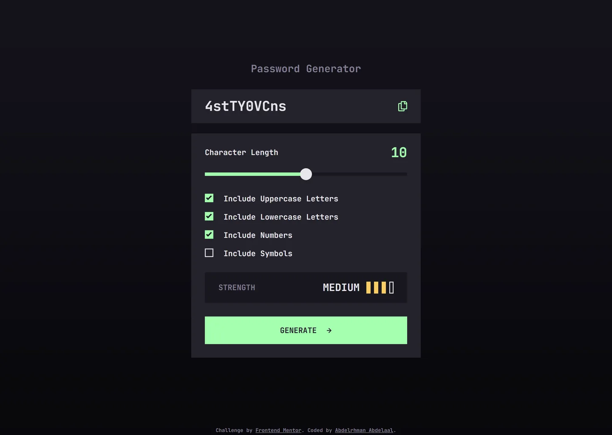

# Frontend Mentor - Password generator app solution

This is a solution to the [Password generator app challenge on Frontend Mentor](https://www.frontendmentor.io/challenges/password-generator-app-Mr8CLycqjh). Frontend Mentor challenges help you improve your coding skills by building realistic projects.

## Table of contents

- [Overview](#overview)
  - [Screenshot](#screenshot)
  - [Links](#links)
- [My process](#my-process)
  - [Built with](#built-with)
  - [Design deviations](#design-deviations)
- [Author](#author)

## Overview

### Screenshot

### Links

- Solution URL: [GitHub](https://github.com/MrBlackvanta/password-generator-app)
- Live Site URL: [Cloudflare](https://password-generator-app.abdelrhman-ahmed8881.workers.dev)
- Mirror: [Netlify](https://vanta-password-generator-app.netlify.app)

## My process

### Built with

- [Next.js 16](https://nextjs.org/) (App Router, React Compiler, Turbopack)
- [React 19](https://react.dev/)
- [TypeScript](https://www.typescriptlang.org/) (strict)
- [Tailwind CSS v4](https://tailwindcss.com/)

No runtime dependencies beyond React and Next. `clsx` and `tailwind-merge` came across from the
previous project and were removed: `cn` was called once, on two class strings with no conflicting
utilities to merge, and dropping both took the app chunk from 12.1 KB to 3.9 KB gzipped.

### Design deviations

**Two of eleven text pairings fail WCAG AA**, measured against the backdrop each one actually sits
on and solved on rounded 8-bit channels. Ratios for anything on the page background use the
gradient's **top** stop, which is its lightest point and therefore the worst case for light ink at
any viewport height. Nothing in this design qualifies as WCAG large text: 24px Bold is large, but
the same role drops to 16px on mobile, and `STRENGTH` at 18px Bold is 13.5pt, just under the 14pt
bold threshold.

|                   | design           | contrast | shipped   | contrast    |
| ----------------- | ---------------- | -------- | --------- | ----------- |
| `STRENGTH` label  | `#817D92`        | **4.47** | `#827E92` | 4.53 / 4.70 |
| Field placeholder | `#E6E5EA` at 25% | **2.07** | `#8A8A94` | 4.54        |

The muted grey is a **one-point move on two channels**, red 129 to 130 and green 125 to 126, blue
untouched. `#817D92` already clears AA as the page title at 4.64 and fails only on the lighter
`#18171F` strength panel, short by 0.03. `#827E92` clears both, so it stays a single token.

The placeholder is the one visible change. The design paints the sample `P4$5W0rD!` at 25% opacity,
which composites to `#54545C` on the card. There is no faint grey that passes: clearing 4.5:1 on
`#24232C` forces a mid grey, and `#85858F` still only reaches 4.25. At `#8A8A94` the hint is
brighter than drawn but still obviously dimmer than a real password at 12.40, so it keeps signalling
"not a value yet".

**Two pairings I checked and deliberately left alone.** The slider's unfilled track against the card
is 1.14 and the card against the page is 1.19. Neither is a 1.4.11 requirement: a container edge is
not a UI component boundary, and the slider is identified by its filled portion at 14.82 and its
thumb at 14.19, which is what the criterion actually asks for. Darkening the card to force 3:1 would
wreck the design for no requirement.

**The page background is a gradient, not a flat colour** — `linear-gradient(to bottom, #14131B,
#08070B)`. The frame's own `#24232C` fill is a leftover sitting behind a full-bleed rectangle that is
what actually ships.

**The design has no letter-spacing, no corner radii and no shadows.** All 90 text nodes measure zero
tracking. All 110 rectangles and ellipses are `cornerRadius: 0`, so every edge in the app is square
and the slider thumb is a circle by geometry rather than by radius. The only nodes carrying effects
are the cursor illustrations annotating the hover frame, so there is not one real shadow. No tokens
for any of the three.

**Line heights are explicit values, not a ratio.** Figma reports `100%` everywhere, deferring to the
font. The design's boxes are 21 / 24 / 32 / 42 at 16 / 18 / 24 / 32, which are ratios of 1.3125,
1.3333, 1.3333 and 1.3125 — **no single multiplier reproduces all four**, because Figma rounded them.
JetBrains Mono's own `normal` measures 20.8 / 24 / 32 / 42.4 in the browser, the same metric rounded
differently. Shipping the design's integers keeps every line box exact instead of carrying a
permanent third-of-a-pixel error.

**The tablet frame is byte-identical to desktop**: same 540px card, same internal offsets, just
centred in 768 at x=114. So there is one structural breakpoint, at 768px, and the card at that width
reproduces the tablet frame exactly. The cost is that the card stops growing at roughly 572px
viewport, so **between 572 and 767 a full-width 540 card still wears mobile padding and 16px type**.
Nothing overflows; it reads as a roomier mobile card. A container query on the card would track the
real dependency, but it trades one arbitrary breakpoint for another.

**The two frames disagree about what is vertically centred.** Desktop centres the field-plus-card
group, exactly: 196 = (1024 - 632) / 2. Mobile centres the whole stack including the title, also
exactly: 63.5 rounds to 64. No single rule satisfies both. The whole stack is centred, which is exact
on mobile and lands the desktop card 14px lower than the mock once the footer takes its share of the
column. Honouring the desktop reading would need the title absolutely positioned above a centred
group, which breaks at short viewports for a 14px gain.

**Geometry that is not round, and where it went.** The desktop card comes out at exactly 528px. The
checkbox pitch is 43 against a 24px label line box, so the gap is 19px — measured, not invented. The
mobile card is 424 against the design's 423, one pixel from rounding a 7px gap up to 8. The design's
43px length row is a Figma group union; the real 32px numeral line box is 42, so the slider and
checkbox band sit 1px high and the total self-corrects by the strength panel.

**The slider range is 0 to 20, settled by the file rather than guessed.** The Empty frame draws the
numeral as `0` with the thumb at the track's left edge and no green fill; the main frame draws `10`
with the fill at exactly 238 of 476, which is 50.0%. Only 0 to 20 satisfies both.

**Strength is Shannon entropy of the selected pool**, `length * log2(poolSize)`, bucketed at 30, 50
and 70 bits. This reproduces the design's only data point: ten characters drawn from uppercase,
lowercase and digits is a 62-character pool, so 59.5 bits, so MEDIUM with three bars of four. A
points system can be tuned to hit the same cell, but entropy is the thing worth defending.

**Strength describes the generated password, not the live settings.** `strengthOf` takes only the
string and inspects which character classes it actually contains, so changing a checkbox after
generating does not retro-rate the password on screen. That matches the brief's own wording and both
design frames, and it keeps the function pure and independently testable.

**Three states the design does not draw.** The Empty frame shows length 0 with nothing checked, which
would make the first Generate a no-op, so the app starts from the main frame's settings — length 10
with uppercase, lowercase and numbers — and an empty field. Generate is `disabled` at half opacity
when no character set is selected. And **focus states are invented entirely**, since the design
specifies hover only: a 2px accent outline at 2px offset, which lands on the card at 12.95 and stays
visible on the accent-filled button.

**The slider is hand-built because no cross-browser filled track exists.** The fill is a
`linear-gradient` on the input driven by a custom property from state, with the thumb styled through
`::-webkit-slider-thumb` and `::-moz-range-thumb` in CSS, since Tailwind utilities cannot reach
vendor pseudo-elements. The hover ring is a `box-shadow` rather than a border because the design's
stroke is `strokeAlign: OUTSIDE`, and a border would shrink the 28px thumb. Focus gets a dark ring
then an accent ring, so the indicator survives whether the thumb sits on the green fill or the dark
track. `:hover` on a range input fires anywhere on the control, which is treated as correct rather
than chased down to thumb-only.

**The copy icon's two sizes come from one rule.** The design draws it 21x24 on desktop and 17.5x20 on
mobile, an awkward 83.3%. Keeping the `viewBox` and setting only the height lets the browser derive
both widths from the aspect ratio, so there are no arbitrary pixel widths in the markup.

**Long passwords wrap rather than scroll or truncate.** Nineteen characters fit one line at 375px and
fifteen at 320px; twenty wraps to two. `break-all` contains it with no horizontal scroll at any
width, and the field keeps the design's 64px height. Truncating would hide part of a value the user
may want to verify, and a scroll container with no keyboard access is its own audit failure.

**Accessibility choices worth naming.** The password lives in an `<output>`, whose implicit
`role="status"` announces each new value. The strength bars are `aria-hidden` because the verdict
word already carries the meaning, and four empty divs in the tree would be noise. The copy-status
live region sits outside the flex row and persists across states, because a conditionally rendered
`aria-live` node never announces and keeping it inside the row would force a permanent 16px gap that
pushes the icon off its content edge. The empty field pairs its hidden visual hint with an sr-only
"No password generated yet", so the state is not conveyed visually only. The checkbox is 20x20,
under the 24px minimum, but the whole label row is the target: 24px tall on desktop, and on mobile
the 37px pitch means no two 24px targets can intersect, which is the spacing exception. The copy
button is grown to 37x40 by a transparent `::after` so it clears 24x24 without moving the icon off
its content edge.

**One bug only the screenshot caught.** The checked box rendered as a solid green square with no
tick. Computed styles said the icon was `visible` with the right colour, and it was — painted
underneath the absolutely positioned input, whose `checked:bg-accent` covered it. Measurement cannot
see paint order; the render did.

**The footer attribution is an addition** — the design has no footer, so it gets its own small size
and sits in normal flow, which is what shifts the centred column by 14px on desktop.

**Two notes for anyone reading the design file.** The arrow beside GENERATE is `icon-arrow-right`
rotated 180 degrees and named `bx_arrow-to-left`, so a parser that accumulates translation without
rotation reports its x off by exactly its own width. And in the Empty frame the single `0` sits in a
box still sized for two characters and right-aligned, so it overhangs the content edge by 19px; the
main frame's `10` fills that same box exactly. Both are duplication artefacts, not intent.

## Author

- UpWork - [Abdelrhman Abdelaal](https://upwork.com/freelancers/~01f0a9479696b61f49)
- Frontend Mentor - [@MrBlackvanta](https://www.frontendmentor.io/profile/MrBlackvanta)
- LinkedIn - [Abdelrhman Abdelaal](https://www.linkedin.com/in/abdelrhman-vanta/)
