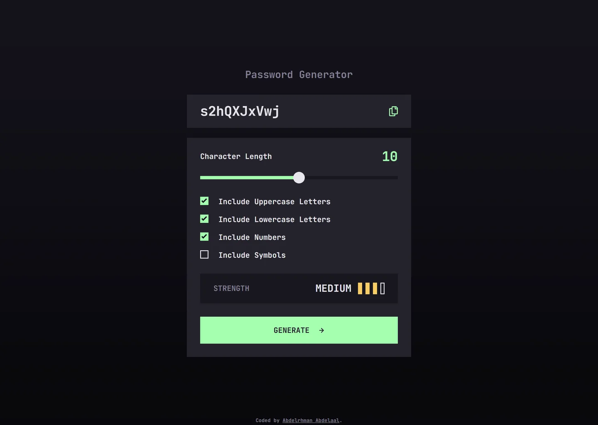

# Password generator app

My solution to the [Password generator app](https://www.frontendmentor.io/challenges/password-generator-app-Mr8CLycqjh)
challenge on Frontend Mentor.

- Live: https://password-generator-app.abdelrhman-ahmed8881.workers.dev
- Code: https://github.com/MrBlackvanta/password-generator-app

## Built with

- Next.js 16, App Router
- React 19 and TypeScript
- Tailwind CSS v4

Nothing at runtime beyond React and Next. `clsx` and `tailwind-merge` came across from the
previous project and came back out: `cn` was called once, on two class strings with no
conflicting utilities to merge, and dropping both took the app chunk from 12.1KB to 3.9KB
gzipped.

## Notes

### Strength

**Strength is Shannon entropy of the selected pool**, `length * log2(poolSize)`, bucketed at
30, 50 and 70 bits. That reproduces the design's only data point: ten characters from
uppercase, lowercase and digits is a 62-character pool, so 59.5 bits, so MEDIUM with three
bars of four. A points system can be tuned to hit the same cell, but entropy is the thing
worth defending.

It describes the generated password, not the live settings. `strengthOf` takes only the
string and inspects which character classes it actually contains, so changing a checkbox
after generating doesn't retro-rate the password on screen. That matches the brief's wording
and both design frames, and it keeps the function pure and testable on its own.

**The slider range is 0 to 20**, settled by the file rather than guessed. The empty frame
draws the numeral as 0 with the thumb at the left edge and no fill; the main frame draws 10
with the fill at exactly 50%. Only 0 to 20 satisfies both.

### Colour

Two of eleven pairings fail. Ratios on the page background use the gradient's top stop, its
lightest point and the worst case for light ink at any viewport height.

|                   | design     | built     | contrast     |
| ----------------- | ---------- | --------- | ------------ |
| STRENGTH label    | `#817D92`  | `#827E92` | 4.47 to 4.53 |
| Field placeholder | ink at 25% | `#8A8A94` | 2.07 to 4.54 |

The grey moves one point on two channels. It already cleared AA as the page title and failed
only on the lighter strength panel, short by 0.03, so one nudge keeps it a single token.

The placeholder is the one visible change. There's no faint grey that passes here: clearing
4.5:1 on the card forces a mid grey. At `#8A8A94` the hint is brighter than drawn but still
obviously dimmer than a real password, so it still reads as "not a value yet".

Two pairings I checked and left alone: the slider's unfilled track against the card, and the
card against the page. Neither is a 1.4.11 requirement. A container edge isn't a UI component
boundary, and the slider is identified by its filled portion and its thumb, which is what the
criterion actually asks for.

### What the design file says

The page background is a gradient, not a flat colour. The frame's own flat fill is a leftover
sitting behind a full-bleed rectangle.

There's no letter-spacing, no corner radii and no shadows anywhere. All 90 text nodes measure
zero tracking, every rectangle is `cornerRadius: 0`, and the only nodes carrying effects are
the cursor illustrations annotating the hover frame. So no tokens for any of the three, and
the slider thumb is a circle by geometry rather than by radius.

Line heights are explicit values rather than a ratio. Figma reports 100% everywhere and defers
to the font, and no single multiplier reproduces all four of the design's boxes, because Figma
rounded them. Shipping the integers keeps every line box exact.

**The tablet frame is byte-identical to desktop**, just centred. So there's one structural
breakpoint at 768. The cost is that the card stops growing around 572px, so between 572 and
767 a full-width card still wears mobile padding and 16px type. Nothing overflows; it reads as
a roomier mobile card.

**The two frames disagree about what's vertically centred.** Desktop centres the field and
card group; mobile centres the whole stack including the title. No single rule satisfies both.
I centre the whole stack, which is exact on mobile and lands the desktop card 14px lower than
the mock once the footer takes its share.

### Additions

Three states the design doesn't draw. The empty frame shows length 0 with nothing checked,
which would make the first Generate a no-op, so the app starts from the main frame's settings
with an empty field. Generate is disabled when no character set is selected. And focus states
are invented entirely, since the design only specifies hover.

**The slider is hand-built, because no cross-browser filled track exists.** The fill is a
gradient on the input driven by a custom property, with the thumb styled through the vendor
pseudo-elements in CSS, since Tailwind utilities can't reach them. The hover ring is a
`box-shadow` rather than a border, because the design's stroke is outside-aligned and a border
would shrink the thumb.

**Long passwords wrap rather than scroll or truncate.** Nineteen characters fit one line at
375px, twenty wraps to two. Truncating would hide part of a value the user may want to verify,
and a scroll container with no keyboard access is its own audit failure.

### Accessibility

The password lives in an `<output>`, whose implicit `role="status"` announces each new value.
The strength bars are `aria-hidden`, since the verdict word already carries the meaning and
four empty divs would just be noise.

The copy-status live region sits outside the flex row and persists across states, because a
conditionally rendered `aria-live` node never announces, and keeping it inside the row would
force a permanent gap that pushes the icon off its content edge.

The checkbox is 20px, under the 24px minimum, but the whole label row is the target, and on
mobile the row pitch means no two targets can intersect, which is the spacing exception. The
copy button is grown by a transparent `::after` so it clears 24px without moving the icon.

**One bug only the screenshot caught.** The checked box rendered as a solid green square with
no tick. Computed styles said the icon was visible with the right colour, and it was: painted
underneath the absolutely positioned input, whose checked background covered it. Measurement
can't see paint order.

## Author

- [LinkedIn](https://www.linkedin.com/in/abdelrhman-vanta/)
- [UpWork](https://www.upwork.com/freelancers/mrblackvanta)
- [Frontend Mentor](https://www.frontendmentor.io/profile/MrBlackvanta)
